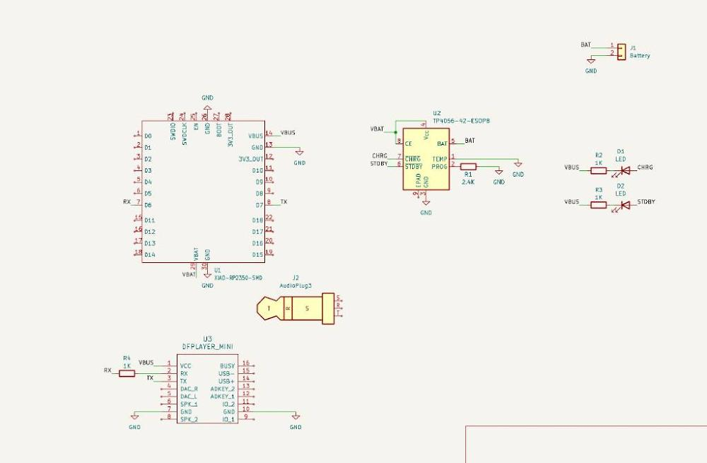
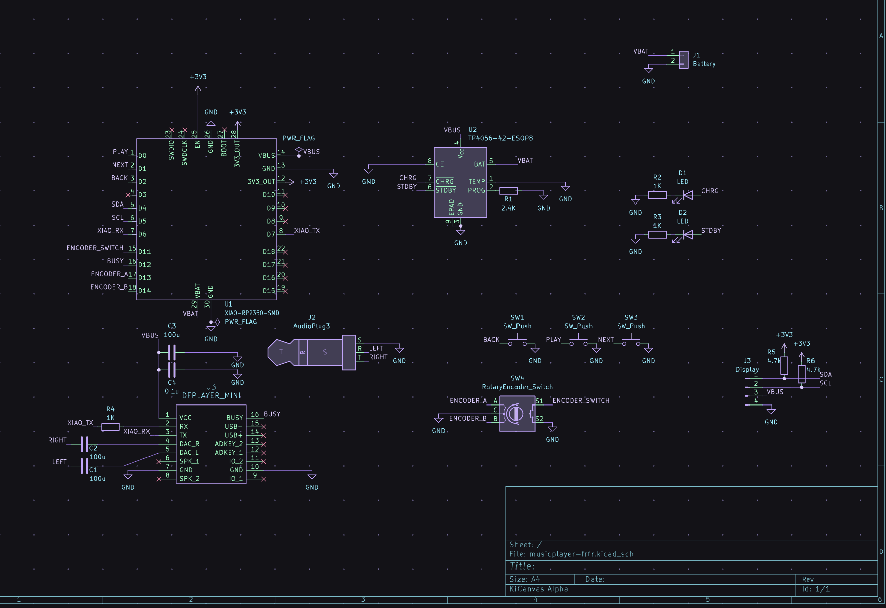
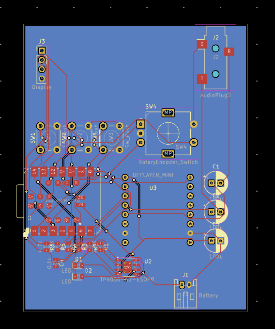
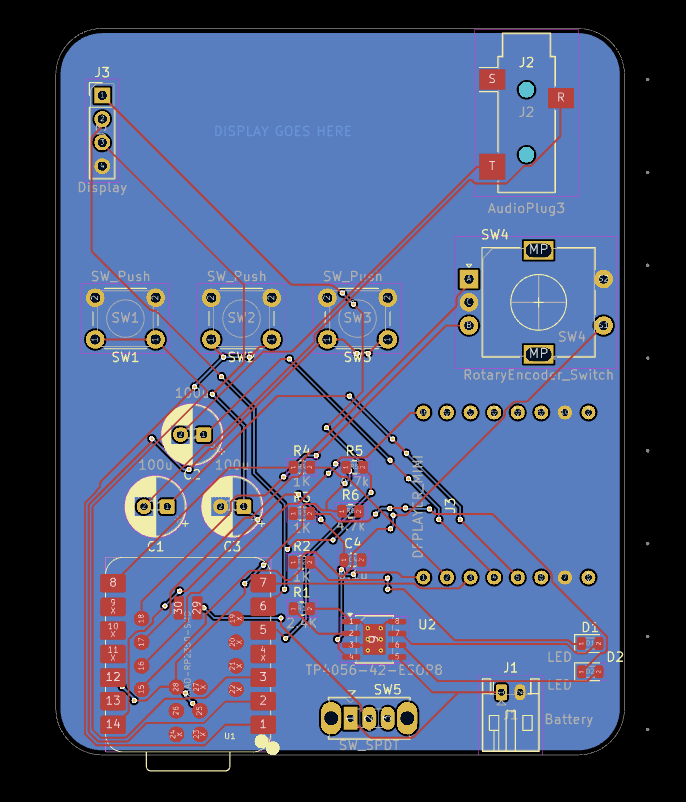
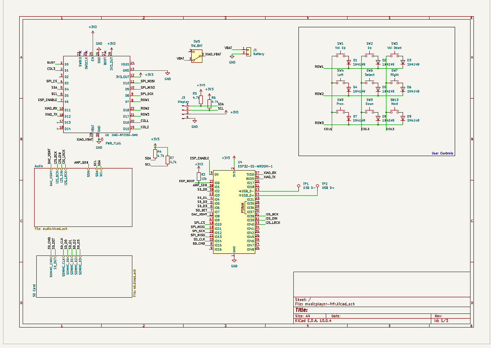
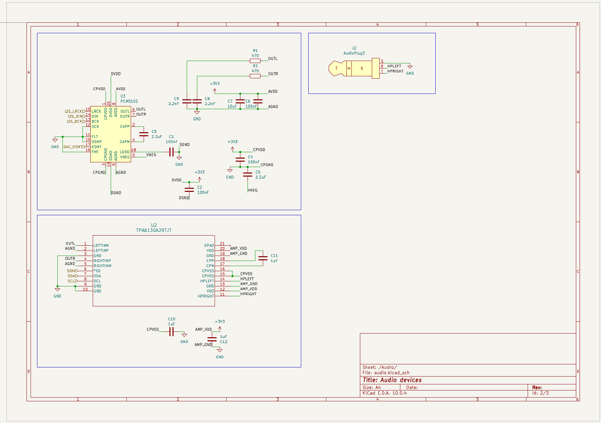
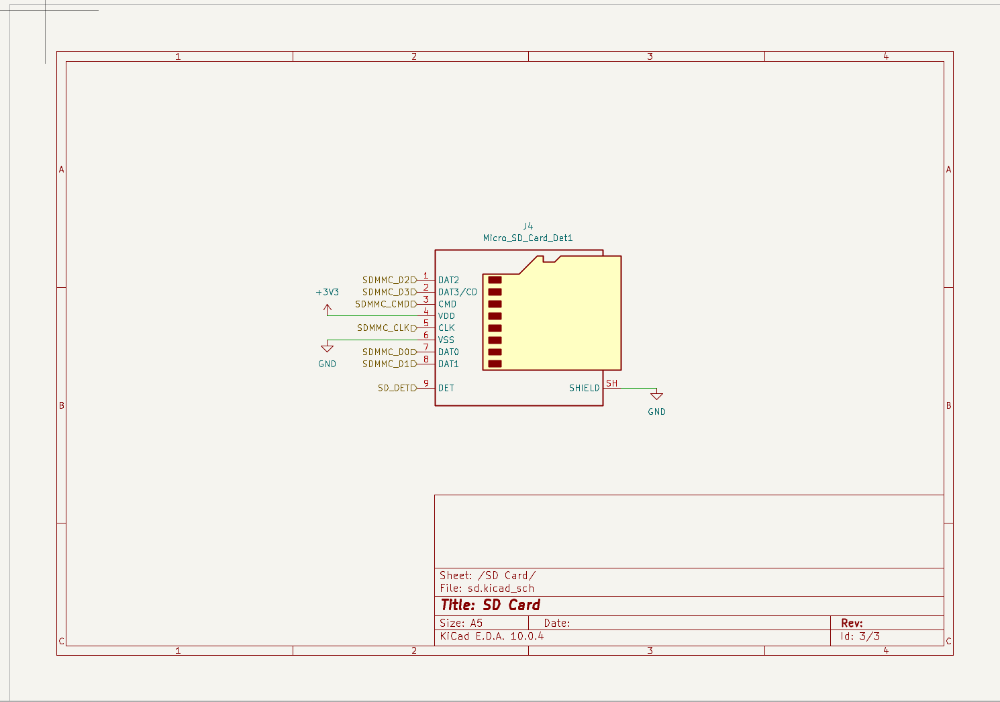
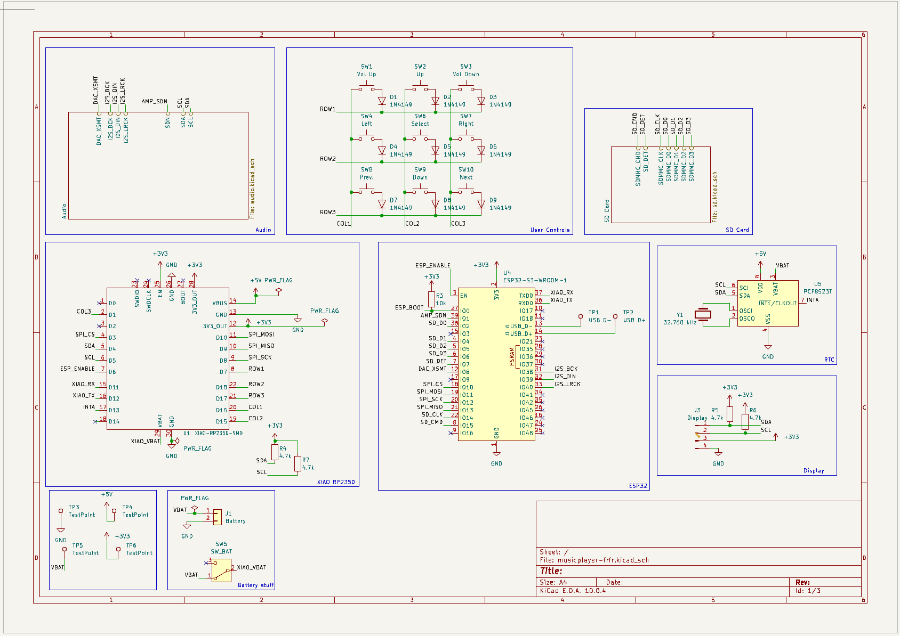

# August 18: Started project
I started this project for the lock in huddle and decided on using a seeed xiao rp2350 and a dfplayer mini for the main electronics. I also started working on the schematic and got half way through wiring the seeed,and the tp4056 chip with the battery.

**Total Time Spent**: 2 Hours

# August 19:
I locked in on finishing the schematic! I finished wiring the dfplayer mini with the audio jack and completed the battery circuitry! Kai Checked my schematic and realized i was send excess electricity from my leds to vbus not ground and i fixed it. When I was adding the oled, it turns out that theres basically no information about the display that i was going to use, which is also the same as the hackpad display.

**Total Time Spent**: 2 Hours

Also finished my PCB and made it about the size of an ipod! I used this plugin called (KiCad Routing tools)[https://github.com/drandyhaas/KiCadRoutingTools] and it made routing so much easier and faster!

**Total Time Spent**: 1 Hour

# August 21:
I made some changes to make the board a lot nicer like rounding the corners and redoing the layout so that the xiao is at the bottom. I also added a power switch so i should be able to toggle power and still charge it while off.

**Total Time Spent**: 1 Hour

# August 24:
I fixed my fabrication files with this cool plugin called fabrication toolkit and i also fixed kicad being stupid and not importing parts or something. I also added a nice silkscreen of orpheus going woah.

**Total Time Spent**: 2 Hours

# Sep 23: Redesigned Whole Schematic
I redesigned the whole schematic to be more interesting and be able to handle more use cases. I kept the Xiao RP2350 as a main processor for handling the UI and display, but removed the dedicated battery charging chip because I learnt that the Xiao supports that built in. I scrapped the DFplayer because it could only handle MP3 files, had weird ways of choosing what to play, and only supported mono audio. Instead, I replaced it with a PCM5102 DAC and a TPA6130A2RTJT Headphone amplifier. This gives me a lot better control over the volume and more flexibility over whats playing. The RP2350 does not have great support for decoding audio codecs like AAC, so I added an ESP32-S3-WROOM  connected to the RP2350 over SPI to do audio decoding and control the DAC and Amp. Another advantage of this is that the ESP32 also has Bluetooth and Wi-Fi so I could theoretically add support for a phone app to upload music and maybe even last.fm scrobbling support with a RTC. I switched it to use a 9 button array for controls and a bigger screen where you can actually read the text. For storing music, I used an SD Card reader that is directly connected over SDMMC to the ESP32.

**Total Time Spent**: 3.5 Hours

# Sep 28: Add RTC
I added a Real Time Clock to keep accurate time. Now I should hopefully be able to log when songs were played and scrobble them to Last.fm. I reorganized my schematic as well.

**Total Time Spent**: 1.5 Hours
